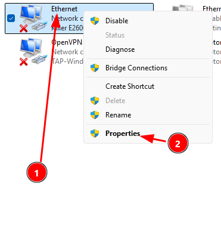
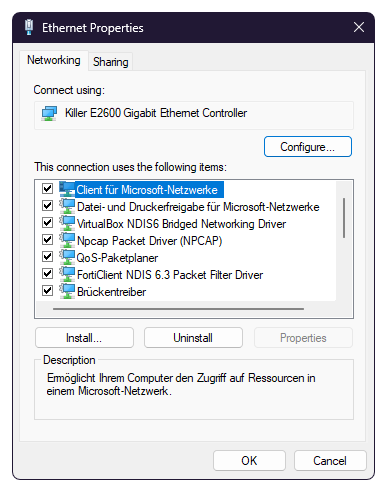
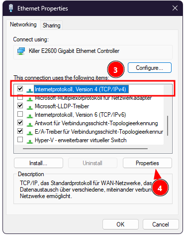
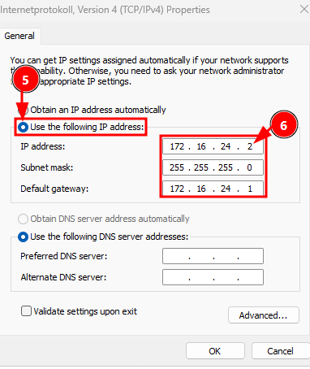

# AlternativeLink
Implementation of the SharkLink protocol for PC and other devices.

Currently only a working python prototype.

## How to try it out

### One Shark Jack Display & One PC

This is probably one of the easies combos.

Step 1:
Get both in the same network. Either directly connecting the Shark Jack to the PC in `static` attackmode and configuring the adapter settings.

Step 1.1:
In windows in the control panel under `Control Panel\Network and Internet\Network Connections` right click on the correct adapter. Probably it's named Ethernet.

Step 1.2:
Then click on Properties.

A window like shown in the Image above should appear.

Step 1.3:
Find Internetprotokoll, Version **4** (TCP/IPv4) and select it.

Step 1.4:
Then click on Properties.

Step 1.5:
Switch to `Use the following IIP address:`

> [!NOTE]
> You will need to switch this back manually later when using your Ethernet.

Step 1.6:
Set the `IP address:` field to `17216.24.2` like in the image shown. Then set the `Subnet mask:` to `255.255.255.0`. And lastly set `Default gateway:` to `172.16.24.1`.

Now just click OK and OK again, then you should be set.
